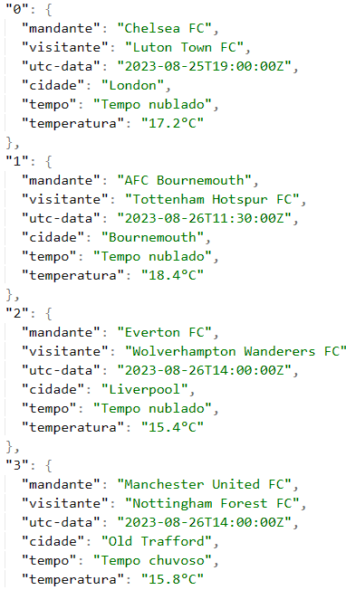

# DIO-Explorando-IA-Generativa-em-um-Pipeline-de-ETL-com-Python
Simples projeto para testar o uso de Api's, ETL e IA.
Projeto para fins educacionais, Consistindo em:

1. Extrair dados do site "https://www.football-data.org/" utilizando sua API.

2. Transformar os dados fazendo uso API OpenWeatherMap para prever o clima para os horários dos jogos do passo 1.

3. Carregar os dados em um arquivo json

# Exemplo de saída de dados

